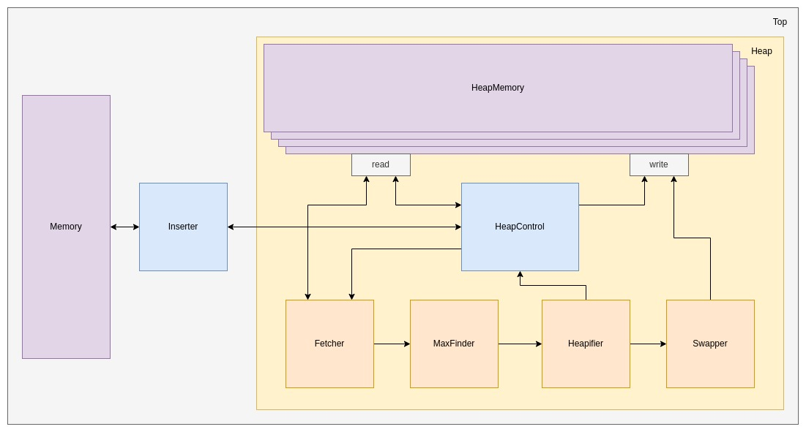

# Heap sort in hardware



See performance table [here](doc/CycleTable.md).

# Create a new file with test values
```shell
make test-files/<file-name>.txt N=? W=?
```

# Emit verilog RTL
```shell
make gen K=? W=? TEST_FILE=test-files/<file-name>.txt
```
Verilog RTL is placed in `/build`.

# Run Xilinx Vivado synthesis for Basys3
```shell
make synth K=? W=? TEST_FILE=test-files/<file-name>.txt
```
Utilization and timing analysis reports are placed in `/build`

# Program Basys3
```shell
make download K=? W=? TEST_FILE=test-files/<file-name>.txt
```

# Run RTL tests
```shell
make rtl-test
```

# Performance
Create performance table for different sizes and tree orders:
```shell
make performance-table
```